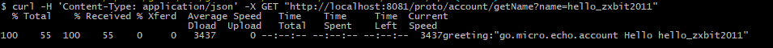

# Go Micro 微服务 - 账户服务

> namespace：go.micro.echo.api.account

### 启动微服务（在`account\api`执行）：
```
go run main.go
```
### 测试(`需要运行website\web项目，端口是：8080`)：
```
$ curl -H 'Content-Type: application/json' -X GET "http://localhost:8081/proto/account/getName?name=hello_zxbit2011"
```
### 执行结果
[](api/test/1.png)
