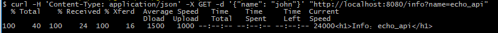

# Go ECHO + Micro 微服务 - 官网站点API服务
> namespace：go.micro.echo.api.website - v1.1

### 启动（在`website\api`执行）：
```
go run main.go
```
### 测试：
```
$ curl -H 'Content-Type: application/json' -X GET -d '{"name": "john"}' "http://localhost:8080/info?name=echo_api"
```
### 执行结果
[](test/1.png)

